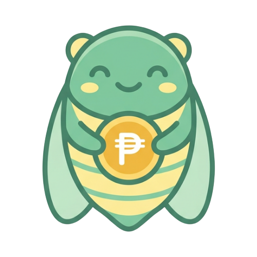

  

  <h1>Semi</h1>
  
<strong>Breaking the one-day millionaire cycle.</strong>

  

    
    
  

---

## 💡 What is Semi?

The name **Semi** has two strong meanings that reflect exactly what this app is built to solve:

1. **The Filipino Payday:** 
   "Semi" is short for semi-monthly salary — *tuwing semi*, the familiar payday that arrives every 15th and 30th of the month.
2. **The Japanese Cicada:** 
   In Japanese, "Semi" (セミ) means cicada. It serves as a perfect metaphor for the "one-day millionaire" cycle: quiet for 15 days, suddenly loud and alive on payday, spending everything fast, and then going broke and quiet again.

## 🎯 Our Mission

Semi is a personal finance tracker designed specifically for Filipino employees. Its goal is simple: **help you plan your 15th and 30th salary before you spend it.** 

With Semi, you will always:
- ✅ **Know how much salary was actually received.**
- ✅ **Know exactly where every peso should go.**
- ✅ **Know which specific wallet or bank account holds that money.**
- ✅ **Avoid the trap of spending everything on payday.**
- 🌟 **Break the one-day millionaire cycle.**

---

## ✨ Key Features

* **Bi-Monthly Budgeting:** Automatically split your budget templates between your 15th and 30th paychecks.
* **Smart Envelopes:** Divide your money into clear categories (like Rent, Savings, Groceries) so every peso has a job.
* **Wallet Tracking:** Keep track of where your physical money is located, whether it's in GCash, Maya, BDO, or physical cash.
* **Actual Balance Reconciliation:** Easily update your app balances to match your real-world bank accounts, and automatically pull the missing difference directly from your envelopes.
* **Debt & Payable Tracking:** Keep an eye on money you owe or installments you are paying off.
* **100% Offline & Private:** Your financial data is deeply personal. Semi works completely offline. Your data never leaves your phone, and it is protected by your own secure PIN or Biometrics (FaceID/Fingerprint).

---

## 🛠 Currently in Testing Phase

Semi is currently in an active testing and beta phase. Features are actively being refined to ensure the best, most premium experience for managing your hard-earned salary.

  
<em>Designed with care for the modern employee.</em>

