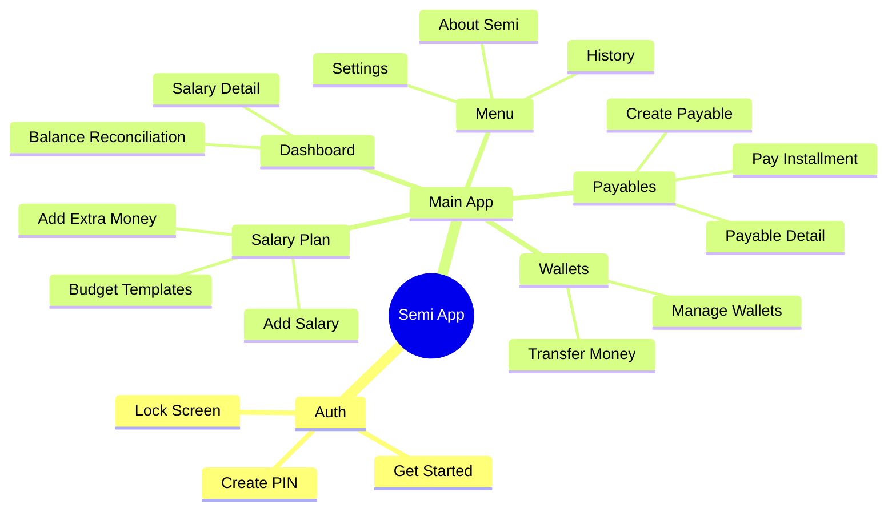
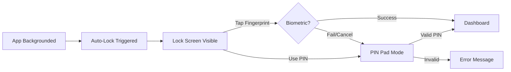

# Semi Project Flow & Screen Navigation

This document details the user journey and navigation logic of the Semi application.

## 1. Application Entry Flow

## 2. Core Navigation Structure

The application uses a **3-Tab Bottom Navigation System** alongside a **Primary Action FAB** and a **Top Profile Menu**.

### Persistent Floating Navigation
Located at the bottom of the screen on most major screens.

| Element | Target Tab/Screen | Purpose |
| :--- | :--- | :--- |
| **Dashboard Icon** | Dashboard | Financial status overview (Am I okay?) |
| **Wallets Icon** | Wallets Screen | Manage balances and Transfer (Where is my money?) |
| **Payables Icon** | Payables Screen | Track debts and installments (What do I owe?) |
| **FAB (+)** | Salary Plan Modal | Log income and allocate budget (Where should my salary go?) |

### Top Bar Actions
| Element | Interaction | Target Screen | Purpose |
| :--- | :--- | :--- | :--- |
| **Profile Icon (Right)** | Press | Menu Screen | Access history and settings (What happened before?) |

---

## 3. Screen Interaction Flow

### Dashboard Screen
The central hub for financial oversight.
*   **Wallet Tiles**: Press any wallet to go to **Wallets Management**.
*   **Recent Movements**: Press any entry to go to **Salary Detail Screen**.
*   **"Manage" (Wallets)**: Press to go to **Wallets Management**.
*   **Profile Button**: Press to go to **Security Settings**.

### Salary Plan Hub
The central hub for logging income and planning allocations.
*   **New Salary**: Navigates to Add Salary Screen.
*   **Extra Money**: Navigates to Add Extra Income Screen.
*   **Budget Templates**: Opens allocation rules configuration.

### Add Salary Screen
The entry point for new regular income.
*   **Save Salary Button**: Validates input and redirects to **Salary Detail Screen**.

### Wallets Management
*   **Add New Wallet Button**: Opens the creation form.
*   **Transfer Money Button**: Navigates to Transfer Screen.
*   **Wallet Cards**: Displays current balances.

### Payables Screen
*   **Create Payable**: Opens form to add new debt.
*   **Payable Detail**: View schedules and log an installment.

### Security Settings
*   **Reset Security PIN**: Clears current PIN and requires new setup.
*   **Switches**: Toggle "Lock on Background" or "Biometric Unlock".

---

## 4. Security Flow (Lock & Auth)

## 5. Summary of Button Mappings

| From Screen | Button / Element | To Screen |
| :--- | :--- | :--- |
| **Dashboard** | Wallet Card | Wallets Screen |
| **Dashboard** | Transaction Item | Salary Detail |
| **Dashboard** | Balance Reconciliation | Balance Reconciliation Screen |
| **Nav (Bottom)** | Dashboard | Dashboard Screen |
| **Nav (Bottom)** | Wallets | Wallets Screen |
| **Nav (Bottom)** | Payables | Payables Screen |
| **Top Bar** | Profile Icon | Menu Screen |
| **Nav (FAB)** | (+) Button | Salary Plan Modal |
| **Salary Plan** | Add Salary | Add Salary Screen |
| **Salary Plan** | Budget Templates | Budget Templates |
| **Wallets** | Transfer Money | Transfer Screen |
| **Menu Screen** | History | History Screen |
| **Menu Screen** | Settings | Security Settings |
| **Security** | Reset PIN | Clear State / Lock |
