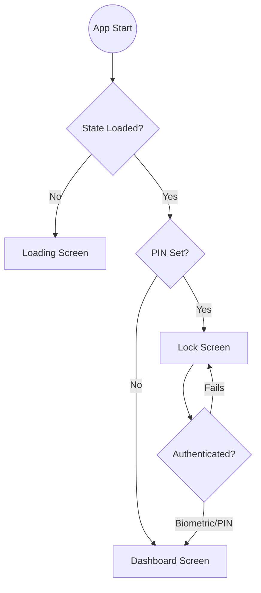
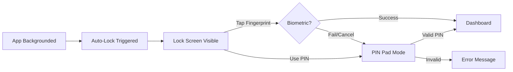

# Semi Project Flow & Screen Navigation

This document details the user journey and navigation logic of the Semi application.

## 1. Application Entry Flow

## 2. Core Navigation Structure

The application uses a **Floating Navigation System** and a **Top Bar Menu** for primary navigation.

### A. Persistent Floating Navigation (FAB + Bottom Bar)
Located at the bottom of the screen on most major screens.

| Element | Interaction | Target Screen |
| :--- | :--- | :--- |
| **Home Icon** | Press | Dashboard |
| **Budget Icon** | Press | Budget Template Screen |
| **Wallets Icon** | Press | Wallets Management |
| **FAB (+) Button** | Press | Add Salary Screen |

### B. Top Bar Actions
Located at the top of the screen.

| Element | Interaction | Target Screen |
| :--- | :--- | :--- |
| **Menu Icon** (Left) | Press | Sidebar Menu (Overlays) |
| **Profile Icon** (Right) | Press | Security Settings |
| **"Semi" Title** | View | Branding indicator |

---

## 3. Screen Interaction Flow

### Dashboard Screen
The central hub for financial oversight.
*   **Wallet Tiles**: Press any wallet to go to **Wallets Management**.
*   **Recent Movements**: Press any entry to go to **Salary Detail Screen**.
*   **"Manage" (Wallets)**: Press to go to **Wallets Management**.
*   **Profile Button**: Press to go to **Security Settings**.

### Add Salary Screen
The entry point for new income.
*   **Save Salary Button**: Validates input and redirects to **Salary Detail Screen**.

### Wallets Management
*   **Add New Wallet Button**: Opens the creation form.
*   **Wallet Cards**: Displays current balances.

### Budget Template Screen
*   **Amount Inputs**: Editable fields that save automatically on change.
*   **Add Allocation**: Placeholder for future allocation logic.

### Security Settings
*   **Reset Security PIN**: Clears current PIN and requires new setup.
*   **Switches**: Toggle "Lock on Background" or "Biometric Unlock".

---

## 4. Security Flow (Lock & Auth)

## 5. Summary of Button Mappings

| From Screen | Button / Element | To Screen |
| :--- | :--- | :--- |
| **Dashboard** | Wallet Card | Wallets Screen |
| **Dashboard** | Transaction Item | Salary Detail |
| **Dashboard** | Profile Icon | Security Settings |
| **Dashboard** | Nav Home | Dashboard (Refresh) |
| **Dashboard** | Nav Budget | Budget Templates |
| **Dashboard** | Nav Wallets | Wallets Screen |
| **Dashboard** | FAB (+) | Add Salary |
| **Add Salary** | Save Button | Salary Detail |
| **Any** | Menu -> History | History Screen |
| **Any** | Menu -> Settings | Security Settings |
| **Lock Screen** | Use PIN | PIN Entry Mode |
| **Security** | Reset PIN | Clear State / Lock |
